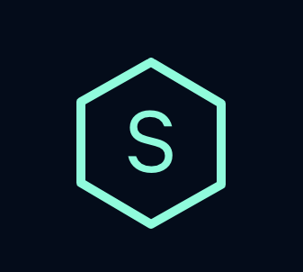
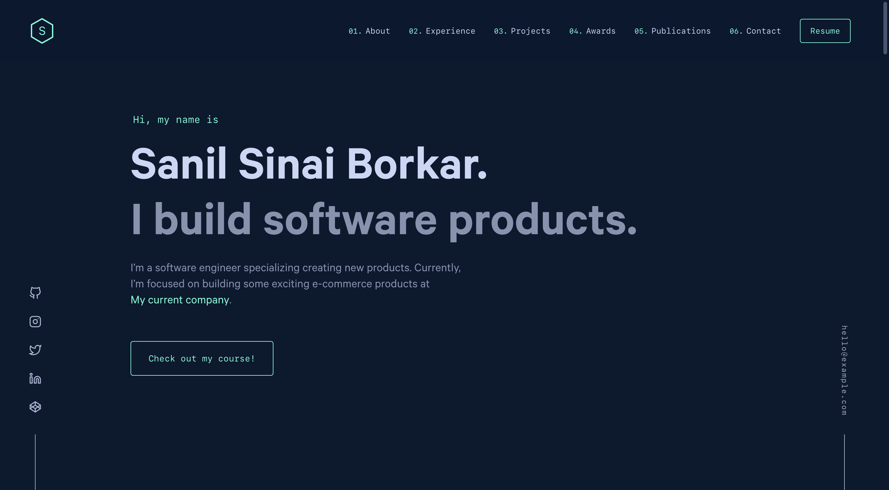

<div align="center">
  
</div>
<h1 align="center">
  Portfolio Website - Version 1
</h1>
<p align="center">
  First iteration built with <a href="https://www.gatsbyjs.org/" target="_blank">Gatsby</a> and <a href="https://www.contenful.com/" target="_blank">Contentful</a>
</p>
<p align="center">
  If you want a markdown data driven project, please check the <i>master</i> branch.
</p>
<!-- <p align="center">
  <a href="https://app.netlify.com/sites/brittanychiang/deploys" target="_blank">
    
  </a>
</p> -->



## 🚨 Forking this repo (please read!)

Yes, you can fork this repo.

**This project has been built and designed by [brittanychiang.com](https://brittanychiang.com).**

**Please give proper credit by linking back to [brittanychiang.com](https://brittanychiang.com). Thanks!**

## Added Features

In addition to the [original repo](https://github.com/bchiang7/v4), the following features have been added:

- Awards section
- Publications section

If you do not need any of these extra sections, please follow these steps:

- Head over to the `src/config.js`, and you can remove the section you do not want from under `navLinks`. This will remove the section from the navigation bar.
- Head over to the `src/pages/index.js`, and remove the concerned section tag from under `<Layout>` tag. This will remove the section from the page.

If Gatsby complains because it is not able to fetch data from [Contentful](#contentful), it may be because the static query on the concerned sections page (under `src/components/sections`) is failing. If this is the case, please comment out or delete the said `.js` file from under the `src/components/sections`, and try again.

## Contentful

Before you start setting this project up, please read the documentation on how to set up Contentful [here](docs/contentful.md).

## 🛠 Installation & Set Up

1. Install the Gatsby CLI

   ```sh
   npm install -g gatsby-cli
   ```

2. Install and use the correct version of Node using [NVM](https://github.com/nvm-sh/nvm)

   ```sh
   nvm install
   ```

3. Install dependencies

   ```sh
   yarn
   ```

4. Start the development server

   ```sh
   npm start
   ```

## 🚀 Building and Running for Production

1. Generate a full static production build

   ```sh
   npm run build
   ```

1. Preview the site as it will appear once deployed

   ```sh
   npm run serve
   ```

## 🎨 Color Reference

| Color          | Hex                                                                |
| -------------- | ------------------------------------------------------------------ |
| Navy           |  `#0a192f` |
| Light Navy     |  `#112240` |
| Lightest Navy  |  `#233554` |
| Slate          |  `#8892b0` |
| Light Slate    |  `#a8b2d1` |
| Lightest Slate |  `#ccd6f6` |
| White          |  `#e6f1ff` |
| Green          |  `#64ffda` |
